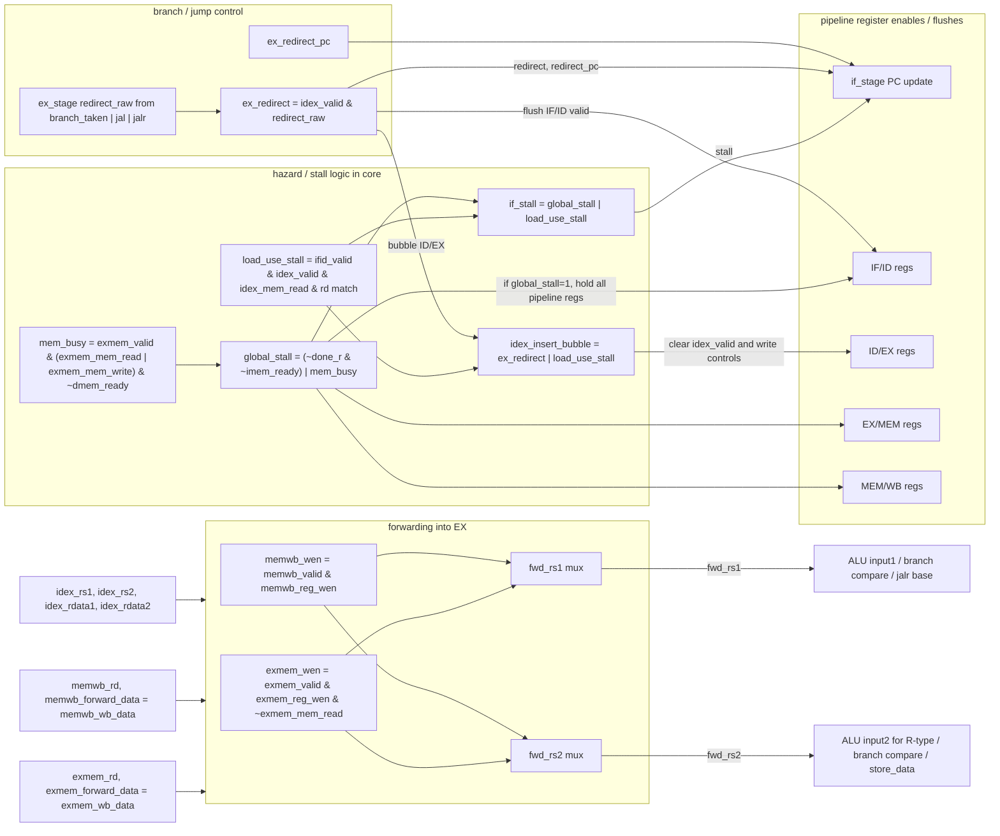

# Pipeline CPU Diagram

## Datapath and Stage Registers

```mermaid
flowchart LR
    subgraph IF["IF: if_stage"]
        PC["pc"]
        IFLOGIC["pc+4 / predict mux / redirect mux"]
        IMEM["I-cache interface"]
        PC --> IFLOGIC
        IFLOGIC --> PC
        PC -->|"imem_addr"| IMEM
        IMEM -->|"imem_ready, imem_rdata"| IFOUT["if_pc, if_pc4, if_inst"]
    end

    subgraph IFID["IF/ID regs"]
        IFIDV["ifid_valid"]
        IFIDPC["ifid_pc"]
        IFIDPC4["ifid_pc4"]
        IFIDINST["ifid_inst"]
    end

    subgraph ID["ID: id_stage"]
        DECODE["decode instruction"]
        RF["register_file"]
        IMM["imm_i, imm_s, imm_b, imm_j, imm_u"]
        CTRL["control decode"]
        ALUCTRL["alu_ctrl_gen"]
        DECODE --> RF
        DECODE --> IMM
        DECODE --> CTRL
        DECODE --> ALUCTRL
    end

    subgraph IDEX["ID/EX regs"]
        IDEXD["idex_pc, idex_pc4"]
        IDEXR["idex_rdata1, idex_rdata2"]
        IDEXI["idex_imm_i/s/b/j/u"]
        IDEXREG["idex_rs1, idex_rs2, idex_rd"]
        IDEXC["idex_funct3, idex_alu_ctrl, idex_* control"]
    end

    subgraph EX["EX: ex_stage"]
        FWD["forward muxes"]
        ALU["ALU"]
        BR["branch/jump resolve"]
        WBDATA["ex_wb_data select"]
        FWD --> ALU
        FWD --> BR
        ALU --> WBDATA
    end

    subgraph EXMEM["EX/MEM regs"]
        EXMEMA["exmem_alu_result"]
        EXMEMS["exmem_store_data"]
        EXMEMW["exmem_wb_data"]
        EXMEMR["exmem_rd"]
        EXMEMC["exmem_* control"]
    end

    subgraph MEM["MEM: mem_stage"]
        DMEM["D-cache interface"]
        MEMWBSEL["load data / ex_wb_data select"]
        DMEM --> MEMWBSEL
    end

    subgraph MEMWB["MEM/WB regs"]
        MEMWBD["memwb_wb_data"]
        MEMWBR["memwb_rd"]
        MEMWBC["memwb_* control"]
    end

    subgraph WB["WB: wb_stage"]
        WBLOGIC["wb_wen, wb_rd, wb_wdata"]
    end

    IFOUT -->|"if_pc, if_pc4, if_inst"| IFID
    IFID -->|"ifid_inst"| DECODE
    IFID -->|"ifid_pc, ifid_pc4"| IDEXD
    RF -->|"id_rdata1, id_rdata2"| IDEXR
    IMM -->|"id_imm_i/s/b/j/u"| IDEXI
    DECODE -->|"id_rs1, id_rs2, id_rd, id_funct3"| IDEXREG
    CTRL -->|"id_mem_read, id_mem_write, id_reg_wen, id_branch, id_jal, id_jalr, id_flush_instr, id_wb_sel"| IDEXC
    ALUCTRL -->|"id_alu_ctrl"| IDEXC

    IDEXD --> EX
    IDEXR --> EX
    IDEXI --> EX
    IDEXREG --> EX
    IDEXC --> EX

    ALU -->|"ex_alu_result"| EXMEMA
    FWD -->|"ex_store_data"| EXMEMS
    WBDATA -->|"ex_wb_data"| EXMEMW
    IDEXREG -->|"idex_rd"| EXMEMR
    IDEXC -->|"idex_mem_read/write, idex_reg_wen, idex_flush_instr, idex_wb_sel"| EXMEMC

    EXMEMA -->|"dmem_addr = exmem_alu_result"| DMEM
    EXMEMS -->|"dmem_wdata = byte-swapped exmem_store_data"| DMEM
    EXMEMC -->|"dmem_req, dmem_wen"| DMEM
    DMEM -->|"dmem_ready, dmem_rdata"| MEMWBSEL
    EXMEMW -->|"exmem_wb_data"| MEMWBSEL
    MEMWBSEL -->|"mem_wb_data"| MEMWBD
    EXMEMR -->|"exmem_rd"| MEMWBR
    EXMEMC -->|"exmem_reg_wen, exmem_flush_instr"| MEMWBC

    MEMWB --> WBLOGIC
    WBLOGIC -->|"wb_wen, wb_rd, wb_wdata"| RF
```

## Forwarding, Stall, and Flush Control

```mermaid
flowchart LR
    subgraph HAZ["hazard / stall logic in core"]
        LU["load_use_stall = ifid_valid & idex_valid & idex_mem_read & rd match"]
        MB["mem_busy = exmem_valid & (exmem_mem_read | exmem_mem_write) & ~dmem_ready"]
        GS["global_stall = (~done_r & ~imem_ready) | mem_busy"]
        IFS["if_stall = global_stall | load_use_stall"]
        BUB["idex_insert_bubble = ex_redirect | load_use_stall"]
        LU --> IFS
        MB --> GS
        GS --> IFS
        LU --> BUB
    end

    subgraph FWDCTRL["forwarding into EX"]
        EXMW["exmem_wen = exmem_valid & exmem_reg_wen & ~exmem_mem_read"]
        MWBW["memwb_wen = memwb_valid & memwb_reg_wen"]
        F1["fwd_rs1 mux"]
        F2["fwd_rs2 mux"]
        EXMW --> F1
        EXMW --> F2
        MWBW --> F1
        MWBW --> F2
    end

    EXMEMF["exmem_rd, exmem_forward_data = exmem_wb_data"] --> FWDCTRL
    MEMWBF["memwb_rd, memwb_forward_data = memwb_wb_data"] --> FWDCTRL
    IDEXRS["idex_rs1, idex_rs2, idex_rdata1, idex_rdata2"] --> FWDCTRL
    F1 -->|"fwd_rs1"| ALUEX["ALU input1 / branch compare / jalr base"]
    F2 -->|"fwd_rs2"| ALUEX2["ALU input2 for R-type / branch compare / store_data"]

    subgraph CTRLREG["pipeline register enables / flushes"]
        IFPC["if_stage PC update"]
        IFIDCTL["IF/ID regs"]
        IDEXCTL["ID/EX regs"]
        EXMEMCTL["EX/MEM regs"]
        MEMWBCTL["MEM/WB regs"]
    end

    IFS -->|"stall"| IFPC
    GS -->|"if global_stall=1, hold all pipeline regs"| IFIDCTL
    GS --> EXMEMCTL
    GS --> MEMWBCTL
    BUB -->|"clear idex_valid and write controls"| IDEXCTL

    subgraph BRCTRL["branch / jump control"]
        BRRES["ex_stage redirect_raw from branch_taken | jal | jalr"]
        VALIDG["ex_redirect = idex_valid & redirect_raw"]
        RPC["ex_redirect_pc"]
        BRRES --> VALIDG
    end

    VALIDG -->|"flush IF/ID valid"| IFIDCTL
    VALIDG -->|"bubble ID/EX"| BUB
    VALIDG -->|"redirect, redirect_pc"| IFPC
    RPC --> IFPC
```
